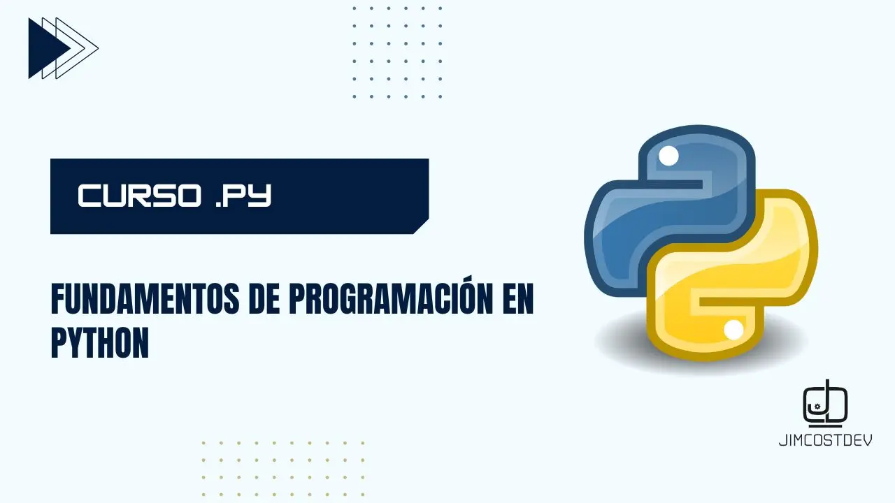

# Fundamentos de Programación en Python 

Este curso está diseñado para ofrecer una guía completa desde los conceptos básicos de programación hasta el dominio práctico de Python. Explora los conceptos básicos de Python con ejemplos claros y prácticos para reforzar tu comprensión.

> !Si te resulta útil este proyecto, apóyalo con una ⭐! Tu apoyo nos motiva a crear más contenido y mejorar los recursos disponibles. ¡Gracias! :octocat:

## Contenido 📚

### 1. Fundamentos de Programación
Encuentra una serie de [materiales teóricos](./00_fundamentos) que cubren los fundamentos esenciales de la programación. Estos conceptos clave te ayudarán a entender la lógica de la codificación.

### 2. Python Básico
Explora los [conceptos básicos de Python](./01_python_basico) con ejemplos claros y prácticos. Refuerza tu comprensión con un conjunto de ejercicios diseñados para poner a prueba tus habilidades recién adquiridas.

### 3. Python Intermedio
Esta sección se enfoca en [temas más avanzados de Python](./02_python_intermedio), como la comprensión de listas, diccionarios y sets, así como el manejo de funciones y errores en el código.

### 4. Python Microsoft
Proporciona una base sólida para aquellos que deseen aprender Python a través de los recursos y [materiales proporcionados por Microsoft](./03_curso_python_microsoft).

### 5. Programación Orientada a Objetos (POO)  
La [Programación Orientada a Objetos (POO)](./04_poo/) es un paradigma que permite estructurar el código en torno a objetos que representan entidades del mundo real. A través de conceptos como clases, objetos, herencia, polimorfismo y encapsulamiento. En esta sección, exploraremos estos principios y su aplicación en el desarrollo de software.  

### 6. Proyectos del Curso
Aquí se encuentran los [proyectos prácticos](./05_proyectos/) que complementan los conocimientos adquiridos en las secciones anteriores. Estos proyectos están diseñados para poner en práctica lo aprendido y fomentar tu creatividad.

## Cómo Utilizar Este Repositorio 🚀

1. **Exploración de Carpetas**: Navega a través de las carpetas para acceder a los materiales teóricos, ejercicios y proyectos.

2. **Materiales Teóricos**: Lee los recursos teóricos para comprender los conceptos antes de abordar los ejercicios y proyectos.

3. **Prueba tus Habilidades**: Utiliza los ejercicios y proyectos como oportunidades para aplicar lo aprendido. Experimenta, comete errores y aprende de ellos.

## Contribuciones 🤝

¡Las contribuciones son bienvenidas y muy apreciadas! Si tienes ideas para mejorar el contenido, corregir errores o agregar nuevos temas, aquí tienes cómo puedes participar:

### Cómo Contribuir

1. **Proponer Mejoras**: Si tienes sugerencias para mejorar la documentación, el contenido o la estructura del repositorio, abre un **Issue** para discutirlo o envía un **Pull Request (PR)** con tus cambios.

2. **Corregir Errores**: Si encuentras errores, ya sean ortográficos, gramaticales o técnicos, siéntete libre de hacer correcciones y enviarlas a través de un **PR**.

3. **Agregar Contenido**: ¿Tienes un artículo, tutorial o ejercicio adicional que crees que sería útil? Añádelo al repositorio y envía un **PR** para revisarlo y agregarlo.

### Cómo Enviar un Pull Request (PR)

1. **Haz un Fork** del repositorio y clónalo a tu máquina local.
2. **Crea una Rama** para tus cambios: `git checkout -b nombre-de-la-rama`.
3. **Realiza los Cambios** necesarios y asegúrate de probarlos.
4. **Commit y Push** los cambios a tu repositorio forked: `git commit -am 'Descripción de los cambios'` y `git push origin nombre-de-la-rama`.
5. **Abre un Pull Request** desde tu repositorio forked hacia el repositorio principal y proporciona una descripción clara de los cambios.

### Agradecimientos

Agradecemos a todos los colaboradores por su tiempo y esfuerzo. Tu participación es fundamental para mejorar y mantener este repositorio útil para la comunidad.

## Recursos Adicionales ℹ️

1. **Aprende Git aquí**: [my-git-notes](https://github.com/JimcostDev/my-git-notes)
2. **Pon a prueba tu lógica con:** [python-ejercicios](https://github.com/JimcostDev/Python_Ejercicios) 🐍
   

## Howdy, soy Ronaldo Jiménez 👋🏻
### Software Engineer & Web Developer :octocat:
<!-- banner -->

<!-- frase de EGW -->
 

