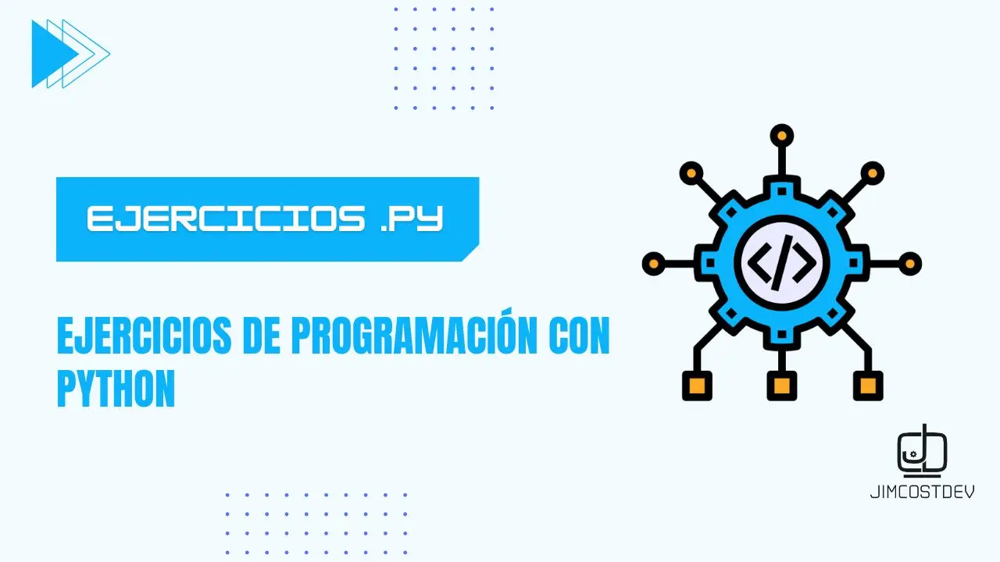

# 🐍 Solucionando problemas de lógica con Python

Bienvenido a mi repositorio de ejercicios y ejemplos de Python. Aquí encontrarás una variedad de problemas para practicar tus habilidades en Python y mejorar tu lógica de programación. ¡Perfecto tanto para principiantes como para programadores más experimentados!

> !Si te resulta útil este proyecto, apóyalo con una ⭐! Tu apoyo nos motiva a crear más contenido y mejorar los recursos disponibles. ¡Gracias! :octocat:

 
